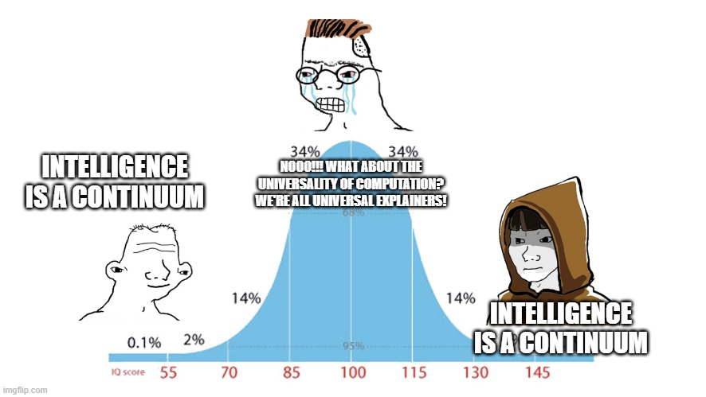

David Deutsch does not think AIs will be fundamentally more powerful than humans:

> The astrophysicist Martin Rees has speculated that somewhere in the universe ‘there could be life and intelligence out there in forms we can’t conceive. Just as a chimpanzee can’t understand quantum theory, it could be there are aspects of reality that are beyond the capacity of our brains.’ But that cannot be so. For if the ‘capacity’ in question is mere computational speed and amount of memory, then we can understand the aspects in question with the help of computers – just as we have understood the world for centuries with the help of pencil and paper. As Einstein remarked, ‘My pencil and I are more clever than I.’ In terms of computational repertoire, our computers – and brains – are already universal ... But if the claim is that we may be qualitatively unable to understand what some other forms of intelligence can – if our disability cannot be remedied by mere automation – then this is just another claim that the world is not explicable. Indeed, it is tantamount to an appeal to the supernatural, with all the arbitrariness that is inherent in such appeals, for if we wanted to incorporate into our world view an imaginary realm explicable only to superhumans, we need never have bothered to abandon the myths of Persephone and her fellow deities.
>
> David Deutsch, The Beginning of Infinity

[Computational universality](https://www.wikiwand.com/en/Turing_completeness) implies that any program which can run on one general-purpose computer can be run on any other. Since the human brain is a computer, whatever program can run on the computer an AI uses (be it a theory of quantum gravity or the recipe for a von Neuman probe) can be run on a human brain.

But wait, even ants are Turing complete, as is the microcontroller in your fridge and Conway’s Game of Life. But we don’t expect your fridge to emit new symphonies from its air ducts or the cells in the Game of Life to spell out the proof of Fermat’s Last Theorem. Why couldn’t we be similarly limited in comparison to superhuman AIs despite having a universal computer in our skulls?

Deutsch argues that this is because humans are universal explainers. We have creativity - the ability to create explanations. This capacity does not exist in increments, you either have it or you don’t. In his view, to suggest that there are some things which we can’t ever understand without some actual explanation for why that is - without even identifying what precisely it is that we can’t understand - is as arbitrary as believing in a God who has placed limits on what we can know.

I will refer to the theory that creativity is a binary variable, that humans and AGIs are universal explainers capable of feasibly understanding or building whatever the other can, and that animals and current AIs are behaviorist automaton lacking any creativity and intelligence, as the **universal creativity hypothesis**.

*The universal creativity hypothesis is incorrect because it cannot explain why some animals are smart and some humans are stupid. Furthermore, I think it is meaningless when we consider the disparities between different computers and irrelevant to the extent that it is compatible with powerful AIs with narrow objective functions.* 

## Some animals are smart

For AIs to have the cognitive repertoire than humans, the ability to create explanations has to be universal. Only then should we expect one intelligent being (future AIs) to just as capable than another (humans). But if creativity is universal, then why do animals seem able to exhibit some bounded forms of creativity and problem solving?

Deutsch answers this question by insisting that animals have no creativity or intelligence whatsoever. In fact, he believes one of the problems that his theory of universal explainers solves is why animals seem to have no intelligence but humans seem to have universal intelligence:

> My guess is that every AI is a person: a general-purpose explainer. It is conceivable that there are other levels of universality between AI and ‘universal explainer/constructor’, and perhaps separate levels for those associated attributes like consciousness. But those attributes all seem to have arrived in one jump to universality in humans, and, although we have little explanation of any of them, I know of no plausible argument that they are at different levels or can be achieved independently of each other. So I tentatively assume that they cannot.
>
> David Deutsch, The Beginning of Infinity

Deutsch dismisses any examples of animal creativity and problem solving as unthinking imitation or genetic knowledge (which accumulates slower and has a miniscule reach in comparison to explanatory knowledge):

> The movements required to crack the nut are never the same twice: the ape has to aim the rock at the nut; it may have to chase the nut and fetch it back if it rolls away; it has to keep hitting it until it cracks, rather than a fixed number of times; and so on. During some parts of the procedure the ape’s two hands must cooperate, each performing a different sub-task. Before it can even begin, it must be able to recognize a nut as being suitable for the procedure; it must look for a rock and, again, recognize a suitable one.
>
> Such activities may seem to depend on explanation – on understanding how and why each action within the complex behaviour has to fit in with the other actions in order to achieve the overall purpose. But recent discoveries have revealed how apes are able to imitate such behaviours without ever creating any explanatory knowledge. In a remarkable series of observational and theoretical studies, the evolutionary psychologist and animal-behaviour researcher Richard Byrne has shown how they achieve this by a process that he calls *behaviour parsing* ...
>
> [I]n behaviour parsing (which evolved millions of years before human language parsing), an ape parses a continuous stream of behaviour that it witnesses into individual elements, each of which it already knows – genetically – how to imitate. The individual elements can be inborn behaviours, such as biting; or behaviours learned by trial and error, such as grasping a nettle without being stung; or previously learned memes. As for connecting these elements together in the right way without knowing why, it turns out that, in every known case of complex behaviours in non-humans, the necessary information can be obtained merely by watching the behaviour many times and looking out for simple statistical patterns – such as which right-hand behaviour often goes with which left-hand behaviour, and which elements are often omitted. It is a very inefficient method, requiring a lot of watching of behaviours that a human could mimic almost immediately by understanding their purpose.
>
> David Deutsch, The Beginning of Infinity

Deutsch is trying to explain complex animal behaviors by using Richard Byrne’s theory of imitation as behavior parsing. This theory states that animals do not need to understand cause and effect relationships or have intentionality in order to fulfill multi-step procedures for food gathering and processing, hunting, etc. 

Byrne writes:

> Consider how this might work for an infant gorilla learning about nettle processing ... By the time a young gorilla first begins to process a nettle plant, at the late age of about 2 years because the stinging hairs discourage earlier attempts, they will therefore have watched many hundreds of plants being processed expertly by the mother. Suppose her behaviour is seen by the infant as a string of elements, each of which is already familiar (i.e. a mirror neuron exists for the element). At this time, the young gorilla’s repertoire of familiar elements of action derives from its innate manual capacities, many hours of playing with plants and discarded debris of the mother’s feeding, and from its own feeding on other, perhaps simpler plants. The string of elements that it sees when watching its mother eat nettles will differ each time, although her starting point is always a growing, intact nettle stem, and—because she is expert at this task—the final stage is always the same: popping a neatly folded package of nettle leaves into the mouth ... Statistical regularities thereby separate the minimal set of essential actions from the many others that occur during nettle eating but which are not crucial to success, and reveal the correct order in which they must be arranged.
>
> R. W. Byrne, [Imitation as behavior parsing](https://pages.ucsd.edu/~johnson/COGS260/Byrne2003.pdf)

Here is why I disagree that this theory can explain away evidence of animal creativity and intelligence:

1. Just because a task involves imitation and statistical pattern recognition does not make it trivial or independent of creative problem solving. Children learn languages in part by imitating the words their parents speak and by noticing statistical regularities between different kinds of words. This does not make the task of learning a language any less impressive. 

   Stating that a task involves statistical pattern recognition does not explain how a chimp extracts patterns of ordered subtasks just from observing instances of the whole task. How does the chimp even recognize that the actions he is observing right now is an instance of a task he is supposed to learn to imitate? How does he learn which details of this iteration to dismiss because they do not fit the pattern, or because they were particular to some irrelevant problem his mother faced this morning. Overfitting to training data is the biggest challenge to imitation learning and to deep learning generally. If you can explain how chimps seem to have bypassed this hurdle, then your solution will be worth many billions of dollars to Tesla, who has been looking for just the thing in order to build self-driving cars:

   > We could simply be overfitting – perhaps our training data set is too small to produce a good solution, which can lead to poor test performance. Avoiding overfitting has long been one of the central concerns in the study of learning theory learning ... the learned policy fails to perform well even with a very large set of training data....
   >
   > [E]rrors cascade in imitation learning but are independent in supervised learning. Consider, for instance, a discrete version of the problem that only predicts “steer left” or “steer right”. Inevitably, our learning algorithm will make some error – let’s say with small probability e for a good learner – and steer differently than a human driver would. At that point, the car will no longer be driving down the center of the road and the resulting images will look qualitatively different then the bulk of those used for training. Imitation learning has difficulty with this situation. The learner has never encountered these images before. Since learners can only attempt to do well in expectation over a distribution of familiar examples, an unusual image may incur further error, often with a higher probability.
   >
   > As a result, the controller driving the simulation will steer the car close to the edge of the road – a very rare occurrence in training – and the resulting decision will likely be quite poor. Often, the learned controller will drive off the road, failing completely at the task
   >
   > J. Andrew Bagnell, [An Invitation to Imitation](https://www.ri.cmu.edu/pub_files/2015/3/InvitationToImitation_3_1415.pdf)

2. Even if this theory can explain how animals can combine different elementary subtasks in order to perform complex behaviors, it still doesn’t explain how animals can execute these basic subtasks without creativity. Take the example of a gorilla stripping nettle plant leaves from their stem. Even this basic action requires cycles of conjecture and refutation which Deutsch believes exemplify creativity. She conjectures that pulling at a certain angle will separate the leaves from the stem without damaging them, but she is refuted when the leaves on the left side of the stem start to crumple. She conjectures that pulling with a certain force will maximize her speed without injuring the plant, but she is refuted when she feels the stem on the verge of snapping. There are a dozen such microcycles of error-correction.

   If you think responding to sensitive information from the environment in order to update your movements can be solved with a trivial algorithm requiring no intelligence, I suggest you write up this program and make a seminal contribution to the field of robotics, which has still not been able to solve this problem completely despite spending decades and billions of dollars of R & D on it [TODO, find better explanations of why this is hard].

   Again, if you think I’m making this sound more complicated than it really is, or if you think you understand how animals can do all this, then I suggest you sell your program for behavior parsing to Amazon and retire a billionaire. They will be more than happy to automate away the moving of packages. Have your program observe the rote programmatic way in which Amazon warehouse workers are asked by a computer to go over there, pick up that package, and put it over there. This is far less complicated than the plucking, cleaning, stripping, and folding of Nettle leaves. 

3. Imitation as behavior parsing does not explain the examples of animals solving problems by engaging in multiple step behaviors whose execution they have never seen before: https://www.youtube.com/watch?v=cbSu2PXOTOc [TODO: convert to embedded video]

The dismissal of animal cognition as behavior parsing reminds me a scene from a Sherlock Holmes story. A client comes in and sits down. Sherlock then starts to tell Watson details about the client just from looking at him - that he lived in China, that he is a Freemason, that he writes a lot, and so on. The client is astonished and asks how Holmes knows all this about him. Sherlock explains the series of clever deductions he made. The client responds:

> "I thought at first that you had done something clever, but I see that there was nothing in it, after all."

To sum up, behavior parsing does not explain many examples of animal cognition, and even if it did, we cannot explain how an animal can parse complex ordered patterns across different observations or imitate even basic actions without some creativity and intelligence.

## Some humans are stupid

It's pretty clear that not even every human is as intelligent (or creative or whatever word you want to use) as the smartest humans. So why should we expect all humans to be nearly as smart as AIs?

David Deutsch is the founder of quantum computing - he proved that you can create a [universal quantum computer](https://royalsocietypublishing.org/doi/pdf/10.1098/rspa.1985.0070?casa_token=lRNhEmrPdn8AAAAA:jv6qLsZU-KlAPSs8pOCXRuY-gSF4M8AuLr_rvVrX3oJglhL6TAmfC0NsLMufwui-cgu2D0obOJ4ArYI), and he designed the first [quantum algorithm](https://royalsocietypublishing.org/doi/pdf/10.1098/rspa.1992.0167) which solves a problem exponentially faster than any classical algorithm.

Do you think every human being could have done that? Do you think every human being could even understand what he did? And if every human can't even understand the things that the smartest humans can, why would every human (or any human) be able to match the cognitive capacity of future AIs?

Sam Harris asked Deutsch a similar question on his [podcast](https://www.samharris.org/blog/surviving-the-cosmos):

> **SH:** ... Imagine that every person with an IQ over 100 had been killed off in a plague in the year 1850, and all their descendants had IQs of 100. Now, I think it’s uncontroversial to say that we would not have the Internet. In fact, it’s probably uncontroversial to say that we wouldn’t have the concept of computation, much less the possibility of building computers to instantiate it.
>
> ... 
>
> there has to be some lower bound past which we would be cognitively closed, even if computation is itself universal, right?
>
> **DD:** Yes, but you have to think about how this cognitive closure manifests itself in terms of hardware and software. Like I said, it seems very plausible that the hardware limitation is not the relevant thing. I would imagine that with nanosurgery, one could implant ideas into a chimpanzee’s brain that would make it effectively a person who could be creative and create knowledge in just the way that humans can. I’m questioning the assumption that if everybody with an IQ of over 100 died, then in the next generation nobody would have an IQ of over 100. It depends on culture.
>
> **SH:** Of course. This was not meant to be a plausible biological or cultural assumption. I’m just asking you to imagine a world in which we had 7 billion human beings, none of whom could begin to understand what Alan Turing was up to.
>
> **DD:** I think that nightmare scenario is something that actually happened. It actually happened for almost the whole of human existence. Humans had the capacity to be creative and to do everything that we are doing. They just didn’t, because their culture was wrong. I mean, it wasn’t really their fault that their culture was wrong, because it inherited a certain biological situation that disabled any growth of what we would consider science or anything important that would improve their lives. So yes, that is possible, and it’s possible that it could happen again. Nothing can prevent it except our wanting it not to happen and working to prevent it.

Deutsch's response here seems like a non-sequitur. Just because culture can limit what ideas a person can have doesn't mean that culture is the only thing which can place such limits or that culture can explain all of the cognitive disparities between people.

If culture is the basis for all differences in intelligence between people, Deutsch must explain why twins separated at birth and adopted by different families (with different cultures) end up having highly correlated levels of intelligence, or why identical twins have a higher correlation of IQ than fraternal twins do[^7]. Such studies shown that intelligence is between 50 to 80% heritable, meaning most of variance in intelligence between people is explained by genes.

[^7]:  Stuart Ritchie, *Intelligence*: "the IQ correlation ... between identical twins is around 0.80 (about the same as the correlation between two sittings of the test by the same person) and that between fraternal twins is lower, at around 0.55 ... this tells us that 50 per cent of the differences in intelligence are due to genetic differences. In behavioural genetic terminology, intelligence is 50 per cent ‘heritable’"

The research shows that intelligence test scores are meaningful and useful; that they relate to education, occupation and even health; that they are genetically influenced; and that they are linked to aspects of the brain. 

Deutsch criticizes how a superficially similar hypothetical study on the heritability of intelligence in 

> no behavioural study can detect whether happiness is inborn or not. Science simply cannot resolve that issue until we have explanatory theories about what objective attributes people are referring to when they speak of their happiness, and also about what physical chain of events connects genes to those attributes....
>
> Now, there are some fundamental problems with such a study from an explanatory point of view. First, how can we measure whether different people’s ratings of their own psychological state are commensurable? That is to say, some proportion of the people claiming to have happiness level 8 might be quite unhappy but also so pessimistic that they cannot imagine anything much better. And some of the people who claim only level 3 might in fact be happier than most, but have succumbed to a craze that promises extreme future happiness to those who can learn to chant in a certain way. And, second, if we were to find that people with a particular gene tend to rate themselves happier than people without it, how can we tell whether the gene is coding for happiness? Perhaps it is coding for less reluctance to *quantify* one’s happiness. Perhaps the gene in question does not affect the brain at all, but only how a person looks, and perhaps better-looking people are happier on average because they are treated better by others. There is an infinity of possible explanations....
>
> So will subsequent bad philosophy. For, suppose that someone now does dare to seek explanatory theories about the cause of human happiness. Happiness is a state of continually solving one’s problems, they conjecture. Unhappiness is caused by being chronically baulked in one’s attempts to do that. And solving problems itself depends on knowing how; so, external factors aside, unhappiness is caused by not knowing how. (Readers may recognize this as a special case of the principle of optimism.)
>
> Interpreters of the study say that it has refuted that theory of happiness. *At most 50 per* *cent* of unhappiness can be caused by not knowing how, they say. The other 50 per cent is beyond our control: genetically determined, and hence independent of what we know or believe, pending the relevant genetic engineering. (Using the same logic on the slavery example, one could have concluded in 1860 that, say, 95 per cent of slavery is genetically determined and therefore beyond the power of political action to remedy.)
>
> David Deutsch, The Beginning of Infinity

Except in the case of the heritability of intelligence, these objections do not apply.

- How do even know that measured intelligence is telling us something real and generalizable which corresponds to abstract thinking, problem solving ability, and capacity to acquire knowledge? As Deutsch asks in the analogous happiness example, "how can we measure whether different people’s ratings of their own psychological state are commensurable?"

  - [TODO]

- Do we actually have any explanations for why differences in the brain could cause disparities in intelligence, and why such differences would be heritable? Or as Deutsch puts it with regards to happiness, "no behavioural study can detect whether happiness is inborn or not. Science simply cannot resolve that issue until we have explanatory theories about what objective attributes people are referring to when they speak of their happiness, and also about what physical chain of events connects genes to those attributes."

  - Here are just some of the biological differences in brains which are correlated with differences in intelligence and which are obviously causally linked to cognitive power, quoted from Stuart Richie's *Intelligence: All That Matters*:

    - "as the brain size of our species increased, so too did our capacity for complex thought. It turns out that this applies when comparing modern people, too: those with bigger brains have higher IQs. This finding has been highly controversial, but it is now so well established and well replicated that it’s pointless to deny it. Again, it makes sense that having more neurons to think with is advantageous. Indeed, a recent review of 148 studies (Pietschnig, 2014) concluded that the correlation between brain volume and intelligence test scores is relatively small, at *r* = 0.24."
    - "Many studies have now shown that this measure of the efficiency of white matter connections is correlated with performance on IQ tests, especially those that involve reasoning and speed. Better connections tend to mean faster and more efficient cognitive abilities (Penke et al., 2012)."
    - "Another important finding from functional imaging relates to brain efficiency. Compared to those with lower ability, the brains of higher-IQ people tend to show *less*, rather than more, activity when completing complicated tasks: this suggests that their brains can more efficiently work through the problems."
    
    Of course, we should expect such traits to be at least partially heritable. If you want to claim that they are not heritable at all, then the onus is on you to explain why all aspects of biological life except for the topography, size, and organization of human brains are partially heritable.
    
    While we can't account for the entire genetic contribution to IQ through known causal mechanisms, we have identified enough to know that genes can cause disparities in intelligence.

- How do we know that the apparent heritability of intelligence isn't instead caused by some X trait which is itself heritable and causes disparities in intelligence by influencing how society treats people with that trait or how people with that trait develop and express their cognitive potential? Deutsch gives the following alternative explanations with regards to happiness, "if we were to find that people with a particular gene tend to rate themselves happier than people without it, how can we tell whether the gene is coding for happiness? Perhaps it is coding for less reluctance to *quantify* one’s happiness. Perhaps the gene in question does not affect the brain at all, but only how a person looks, and perhaps better-looking people are happier on average because they are treated better by others. There is an infinity of possible explanations."

  - As Deutsch has explained, in science you can never prove an explanation. You just have to find a theory which is hard-to-vary and best explains the evidence. There is no plausible alternative explanation which accounts for why adopted twins raised in different households in different social classes and cultures are still much more likely to have similar IQ scores than two random members of the general population. If he has an alternative explanation to the mountains of research which show that g is real, heritable, and predictive of intelligence relevant outcomes, then he is free to provide it. 

    With regards to a possible confounding trait to intelligence analogous to good looks to happiness, Deutsch has to explain, what is this X trait is which is:

    1. So closely correlated with general cognitive ability without being general intelligence itself,
    2. Obvious enough to adoptive parents, teachers, and other members of society that they can use it as a basis for discrimination,
    3. Yet at the same time so concealed that researchers have not even been able to identify it.

    He has to explain why we can't detect this X trait discrimination despite it being so pervasive and intense that it is leading to large cognitive disparities between people who experience it and people who don't. He also has to explain how this type of discrimination could actually cause such cogntive disparities, even if it existed.

- How do we know that so-called "genetic" differences in intelligence cannot be solved by the future growth of  knowledge? Deutsch writes with regards to happiness example, "[This study] cannot detect whether a book will be written one day which will persuade some proportion of the population that all evils are due to lack of knowledge, and that knowledge is created by seeking good explanations. If some of those people consequently create more knowledge than they otherwise would have, and become happier than they otherwise would have been, then part of the 50 per cent of happiness that was ‘genetically determined’ in all previous studies will no longer be so."

  - It is certainly possible that some kind of intervention exists which can bring people with low cogntive ability up to the level of David Deutsch. But there is no guarantee that such an intervention exists.

    To bring us back to the topic of AI, **imagine that humanity is like the people at the bottom of the IQ distribution in comparison to future AIs. What are the odds that these cognitively disadvantaged people (who often lack the capacity to fill out forms or understand basic written instructions)[^4] could by themselves discover a method of increasing their intelligence to David Deutsch's level which decades of social and medical science research have failed to uncover [fix sentence]? If this seems like a remote possibility, then you understand why I am skeptical that humans will be able to augment our computational hardware enough to keep up with future AIs.**

[^4]: Gottfredson, “Suppressing Intelligence Research: Hurting Those We Intend to Help”, h/t [Gwern](https://www.gwern.net/iq)

Here are the questions I am left with for Deutsch about cognitive disparities between different humans:

- Does Deutsch think that there are any genetic differences in intelligence between humans, even if they could be potentially be rectified by genetic or neural engineering in the future? 
  - If not, does he have a plausible alternative explanation for mountains of research on this topic which show that IQ is highly heritable, that it is highly correlated with g, and that it predicts exactly the kinds of life outcomes you would expect general cognitive ability to predict? 
  - And if he thinks genetics has something to do with intelligence, does he think that such endowed differences are at the level of hardware or software? 
    - If software causes intelligence differences, then why can't such differences (but of a larger magnitude) exist between humans and AIs? 
    - If hardware causes these differences, then does he think that if it were just up to the stupidest humans, they would be able to upgrade their brains with neuromodulation to the level of the smartest humans? If not, why is he convinced that smart humans will fare any better in comparison to future AIs?

## Hardware differences matter and may be hard to nullify

To requote the passage I began this essay by excerpting:

> Just as a chimpanzee can’t understand quantum theory, it could be there are aspects of reality that are beyond the capacity of our brains.’ But that cannot be so. For if the ‘capacity’ in question is mere computational speed and amount of memory, then we can understand the aspects in question with the help of computers – just as we have understood the world for centuries with the help of pencil and paper. As Einstein remarked, ‘My pencil and I are more clever than I.’ In terms of computational repertoire, our computers – and brains – are already universal ... But if the claim is that we may be qualitatively unable to understand what some other forms of intelligence can – if our disability cannot be remedied by mere automation – then this is just another claim that the world is not explicable.
>
> David Deutsch, The Beginning of Infinity

I like Gwern's response to this line of argumentation:

> [people sometimes reason](http://www.scottaaronson.com/blog/?p=346) that since a human and AI would be in the same computability class (Turing-completeness), that anything an AI could do or think, a human must also be able to do or think, but they neglect that humans do not have unbounded time or space like the idealized Turing machine and there is no more reason to expect understanding to be possible than to expect an ant to understand everything a human does before it dies of old age; an ant with galaxies of notebooks and billions of years could perhaps understand human civilization, but no such ant has ever existed or ever will
>
> Gwern, [Complexity No Bar To AI](https://www.gwern.net/Complexity-vs-AI)

Deutsch might respond that ants are not universal explainers who can design a more efficient and compact computer and upload their minds onto it. 

I have explained why I think the idea of universal explainers is wrong in the sections above, so I am not convinced that the repertoire of human thought is wide enough to accommodate all the knowledge of neuromodulation necessary to catch up hardware-wise with future AIs. 

The minds of smart animals and stupid humans seem to exist in a strict but nonempty subset of the creativity/intelligence/explanatory repertoire of the smartest humans. Since the principles of neuroimaging and mind-upload are impossible to grasp for all animals and at least some humans, part of what is excluded from that set is the knowledge of how to expand that set.  If it possible for beings to exist in subsets of intelligence that do not contain the tools by which to expand out into their immediate superset, then maybe even smart humans live in such a subset, and the cognitive repertoire of superhuman AIs evades them [fix sentence].

Even if we manage to upload our minds onto faster hardware, I don't know why we would expect the software of human cognition to be compatible with arbitrary expansions of speed and memory while still remaining human. Presumably, there is some sequence of changes you can make to the uploaded version of a dog's mind in order to make it an AGI running at the speed of a modern computer (there must be as long as there is something like the code of a dog and the code of an AGI). But at this point, this code is no longer of a dog's mind. 

And even if we could upload our minds onto the supercomputers used by AIs, and even if that uploaded copy remained recognizably human, why should we expect to master the technology of mapping billions of neurons and perfectly simulating their interactions before we develop an AGI? The time between when we create AGIs and when we can upload our minds will be one where we are cognitively inferior to AIs due to the immense hardware advantages they enjoy, even if theoretically we are equally capable as far as software is concerned. In that time, we will have functionally superhuman AIs , and many of the concerns which AI alarmists riase attention to would be valid.

## Powerful AIs with narrow objective functions seem possible

> An AGI is certainly capable of learning to win at chess—but also of choosing not to. Or deciding in mid-game to go for the most interesting continuation instead of a winning one. Or inventing a new game. A mere AI is incapable of having any such ideas, because the capacity for considering them has been designed out of its constitution. That disability is the very means by which it plays chess. 
>
> David Deutsch, [Possible Minds](http://www.daviddeutsch.org.uk/wp-content/uploads/2019/07/PossibleMinds_Deutsch.pdf)

If an AI program can do all kinds of powerful stuff but still be considered a "mere AI", then I'm wondering if we aren't just having a semantic argument at this point. 

Suppose I'm able to write a deep learning model that makes me a trillion dollars on the stock market. You could argue that such a program doesn't have reach, that it is constrained by the arbitrary objective function I have created for it, and that it can only use implicit statistical patterns in the financial history it has been trained on rather than true conjecture and refutation. 

Okay, whatever. I still have a trillion dollars. 

Would Deutsch argue that no "behaviorist, input-output model"[^2] could do something like finding free energy in the stock market[^3]? Remember, it doesn't have to output a new theory of physics or anything. It simply has to output a prediction of which stocks are likely to beat the market based on current market information and brute force training from past financial history. If such a program is impossible, then why can this family of models [predict a protein's structure](https://rootsofprogress.org/alphafold-protein-folding-explainer) much more accurately and efficiently than any direct simulation can, [become the best player at a game with 10 ^ 360 possible moves](https://deepmind.com/research/case-studies/alphago-the-story-so-far) entirely through self play, and [generate novel and coherent passages of fiction](https://www.gwern.net/GPT-3)? What precisely would the stock market bot have to do which these other programs aren't already doing at a different scale and domain. To suggest an arbitrary limitation on deep learning in the stock market without some explanation for its existence would mean making exactly the same mistake of proposing arbitrary blocks which Deutsch criticizes believers in the idea of superhuman intelligence of making.

Or would he argue that extending current AI techniques to make a trillion dollars in the stock market still hasn't gotten you closer to the goal of making an AGI which can design its own objective function? In which case, who cares? I don't want my get-rich-quick bot to decide to write symphonies or become a moral philosopher instead. I want it to make me lots of money. 

I'm trying to make the point that you can build programs which are not true AIs, but which are still extremely powerful. You can say that they have no creativity, but **if extremely important and previously impossible work can be done by "uncreative" programs, then this diminishes the value of your concept of creativity rather than the value of the programs themselves.** 

By the way, isn't the entire point of AI safety research that you can have programs which are extremely competent at achieving some narrow goal (making lots of money in the stock market) but lack the capacity to evaluate and weigh the costs of achieving these goals (destroying the financial system)? So if Deutsch agrees that such programs are possible, then would he agree with the need for AI safety research and the danger of possible paperclip maximizers.

# Other arguments

Here are some other criticisms of Deutsch's ideas on AI which I would have liked to write about in more details but didn't since this essay is already too long

1. To the extent that Deutsch is worried about AI, he is worried about the righteous slave revolt which will result from imprisoning or cognitively impairing artificial people (a.k.a AI safety):

   > in regard to AGIs, like any other entities with creativity, we have to forget almost all existing connotations of the word ‘programming’. To treat AGIs like any other computer programs would constitute brainwashing, slavery, and tyranny. And cruelty to children, too, for ‘programming’ an already-running AGI, unlike all other programming, constitutes *education*. And it constitutes *debate*, moral as well as factual. To ignore the rights and personhood of AGIs would not only be the epitome of evil, but also a recipe for disaster: creative beings cannot be enslaved forever.
   >
   > David Deutsch, [Creative Blocks](https://aeon.co/essays/how-close-are-we-to-creating-artificial-intelligence)

   This may be a ethically valid argument, but I am not confident that it would be practically wise. Human babies come preprogrammed with all kinds of moral intuitions and judgements without which additional tutoring in right and wrong would be impossible, as Paul Bloom details in his book, *Just Babies*. Presumably, Deutsch would be oppossed to placing moral inclinations we favor into the minds of AGIs. Then he should not be surprised if AGIs happen to have values which we find alien and bizarre.

2. Deutsch writes:

   > how do we create an AGI in the first place? Could we cause them to evolve from a population of ape-type AIs in a virtual environment? If such an experiment succeeded, it would be the most immoral in history, for we don’t know how to achieve that outcome without creating vast suffering along the way.
   >
   > David Deutsch, [Possible Minds](http://www.daviddeutsch.org.uk/wp-content/uploads/2019/07/PossibleMinds_Deutsch.pdf)

   I don't understand why building an AGI through evolution requires suffering. As far as I understand, Deutsch believes that only a being with general intelligence can suffer. So by the time an AI can suffer, it will already be an AGI, at which point the simulation can stop. Where’s the suffering coming from?

[^2]: David Deutsch, [Creative Blocks](https://aeon.co/essays/how-close-are-we-to-creating-artificial-intelligence)
[^3]: The existence of such a program would not be incompatible with the efficient market hypothesis if I was the only person who had access to it. 
