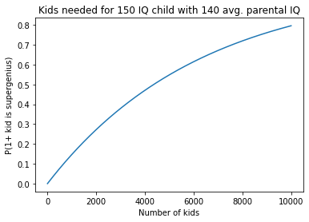
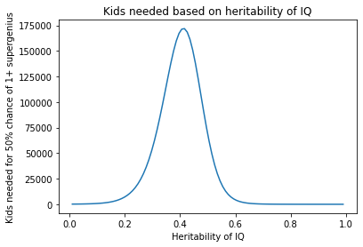
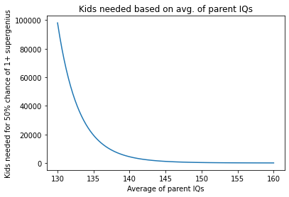
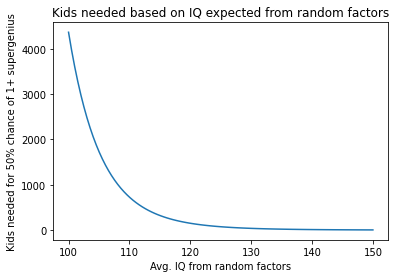

## Introduction

Scott Alexander recently wrote a really interesting blog [post](https://astralcodexten.substack.com/p/secrets-of-the-great-families) about why some families manage to produce super-impressive people generation after generation. He asks how genetic advantages like IQ can persevere through generations given regression to the mean:

> Suppose Erasmus Darwin had a genius-level IQ of 150. And suppose that he tried very hard to marry a bright woman, and his screening mechanism was as successful as the Ivies or Oxbridge when they screen for bright people - in that case his wife would have the same IQ as an average Ivy Leaguer, maybe 130ish. We would predict their average child to have an IQ of 124. Why is the average lower than either parent? Regression to the mean - IQ is probably a combination of genes and random factors, and if your IQ is very high it means you probably have a combination of good genes and good random dice rolls, and even though you can pass on the good genes your kids will probably only get average dice rolls.
>
> But 124 isn’t even as high as the average Ivy Leaguer. If that IQ 124 kid marries another IQ 130 spouse, things deteriorate less quickly - I think the regression process has selected for his 24 IQ point advantage over average being entirely genetic, so it’s not going to regress further. But his spouse’s IQ can still regress further, so they’ll probably end up with a kid who has an IQ somewhere in the high 110s or low 120s - for comparison, not much higher than the average Ashkenazi Jew. Maintaining a super-high-IQ family over several generations is really hard! ...
>
> The answer to [this problem] ... is really impressive assortative mating and having vast litters of children.

## Math

I wanted to crunch the numbers to see how difficult it is to have an incredibly brilliant child. Assuming you are yourself a super-genius, is it really as easy as marrying a decently smart partner and siring half a dozen potential intellectual heirs?

### Setup

By reverse engineering Scott's calculation, we can see that he's using 0.6 for the heritability of IQ ($$h$$):

$$124 = \dfrac{150 + 130}{2} \cdot h + 100 (1 - h)$$

$$h = 0.6$$

We want to figure out how many kids a 150 IQ super-genius like Erasmus Darwin would need to have with his 130 IQ wife in order to have a 50% chance of producing another 150 IQ super-genius. We do that by solving for $$kids$$ in the following equation.

$$0.5 = Pr[1 \text{ or more kids out of } k \text{ have IQ} > 150] \\= 1 - Pr[0 \text{ kids have IQ} > 150] \\= 1 - Pr[\text{Average kid has IQ} \leq 150] ^ {\text{kids needed}}$$[^3]

Rearranging this a bit, we get:

$$\text{kids needed} = \log_{Pr[\text{Average kid has IQ} \leq 150]} 0.5$$

To figure out $$Pr[\text{Average kid has IQ} \leq 150] $$[^1], we first need to figure out the standard deviation of the genetic component of IQ ($$\sigma_g$$) and the environmental component of IQ ($$\sigma_e$$). We can start with the equation for heritability, which is the proportion of the total variance of a trait explained by genetics:

[^1]: I know technically speaking it should be $$Pr[\text{Average kid has IQ} < 150] $$ instead of $$Pr[\text{Average kid has IQ} \leq 150] $$, but the later makes it easier to use the normal distribution CDF.

$$h = \frac{v_g}{v_p}$$

$$0.6 = \frac{v_g}{15 ^ 2}$$

$$ v_g = 135$$

$$\sigma_g = \sqrt{v_g} = \sqrt{135}$$

$$v_e = v_p - v_g = 15^2 - 135 = 90$$

$$\sigma_e = \sqrt{v_e} = \sqrt{90}$$

To figure out the probability that their average kid has an IQ less than 150, we first need to figure out how many standard deviations above average on genetic ($$z_g$$) and environmental factors ($$z_e$$) the kid would need to be in order to have an IQ above 150. Basically, how lucky is the genius kid?

$$150 = (\dfrac{150 + 130}{2} + \sqrt{135} \cdot z_g) \cdot 0.6 + (100 + \sqrt{90} \cdot z_e) \cdot (1 - 0.6)$$

This evaluates to:

$$z_e \approx 6.8516 - 1.83712 z_g$$

$$Pr[\text{Average kid has IQ} > 150]$$ is the sum of $$P(Z > z_g) \cdot P(Z > z_e)$$[^2] over all values of $$z_g$$ and the corresponding value of $$z_e$$. Which means:

[^2]: $$P(Z < x)$$, aka $$\phi(x)$$, is the cumulative density function of the normal distribution, explained [here](https://www.probabilitycourse.com/chapter4/4_2_3_normal.php).

$$
Pr[\text{Average kid has IQ} > 150] =\\ \int_{-\infty}^{\infty} (1 - P(Z \leq z_g)) \cdot (1 - P(Z \leq 6.8516 - 1.83712 z_g)) dz_g \\ \approx 0.00016
$$

$$
Pr[\text{Average kid has IQ} \leq 150] \approx 1- 0.00016 = 0.99984
$$

Using the formula we derived near the start, we can finally figure out **how many kids a super-genius needs to have in order to have at least a 50% chance of producing another super-genius**:

$$
\text{kids needed} = \log_{0.99984} 0.5 \approx 4362
$$

### Results

#### Kids needed to produce a super-genius

In this graph, we can see how many kids Erasmus Darwin would need to have with his Ivy League material wife in order to get different probabilities of producing a super-genius kid:



If even Erasmus Darwin needs to have 4362 kids in order to have coin-flip odds of producing another super-genius, then this really does a number to the genetic explanation for the success of certain families.

But hang on a minute, we made certain assumptions about the heritability of intelligence, the limits of assortative mating, and the average contribution to intelligence from random factors that may not be true.

#### Heritability of IQ

SBF wrote a comment on Scott's blog post:

> You're not taking all successful people at random, you're selecting for people who have successful families -- so you're probably selecting for people who don't just have high IQ, but for whom it's highly genetic/inheritable rather than random factors.

Scott responds:

> This is true! All my regression-to-the-mean calculations were wrong because of selection bias - since we’re looking specifically at geniuses who we know had talented families, we should assume their intelligence was more genetic than average.

We can see how changing the heritability of IQ[^3] while keeping the average parental IQ at 140 changes the amount of kids you need to have to produce a super-genius:

[^3]: I know that heritability is a population level statistic, so just consider the population to be very successful families.



As you would expect, as heritability increases past about 0.4, you need fewer kids to produce super-geniuses.

But wait, why does it become easier to produce super-geniuses if the heritability is below 0.4 ? My guess is that the chance of tail scores increases when population variance $$v_p$$ is mostly constituted by just variance from genetic factors $$v_g$$ or just variance from random factors $$v_e$$, but I'm not sure. That or I did the calculations for $$\sigma_g$$ and $$\sigma_e$$ wrong.

#### Assortative mating

Scott mentions in the article:

> I said before that if an IQ 150 person marries an IQ 130 person, on average their kids will have IQ 124. But I think most of these people are doing better than IQ 130[^4]. I don’t know if Charles Darwin can find someone exactly as intelligent as he is, but let’s say IQ 145.

[^4]: In the post, he says IQ 150 here. But given the context, it seems to me that he made a typo and meant to say 130.

Modifying the equations from the setup, we can see that if we increase average IQ of parents to 147.5, then they would still need to have 591 kids in order to have even-odds of siring a super-genius. So it doesn't seem that assortative mating alone would make the concentration of extreme talent in a family very likely.

Here's a graph which shows how increasing average parental IQ decreases the amount of kids you would need to have:



#### Random factors

Scott writes:

> even though you can pass on the good genes your kids will probably only get average dice rolls.

And I have assumed the same by setting the average IQ contribution from random factors to 100. But this seems wrong. If you're the child of Erasmus Darwin, even the random factors in your life aren't truly random. Think about how much more stuff you're exposed to as a result of being the son or daughter of a great scientist - books, people, opportunities, etc.

If we assume that Erasmus Darwin's kids gets 3 standard deviations above average of random factors, then the number of kids he needs to have in order to father in order have 5-% chance of fathering a super-genius goes down to an entirely reasonable 7!

Here's the graph which shows how the number of kids you would need to have decreases as you increase the average IQ contribution from random factors, keeping average parental IQ at 140 and heritability of IQ at 0.6:



## Concluding thoughts

### I.

Regression to the mean is the great equalizer. Even just IQ seems really hard to pass down. Of course this isn't even to mention that IQ is not the only trait which you need to become a great achiever, and if your kids regress just a bit in each important trait, they're regressing a ton in their cumulative ability. And since great achievement follows a power law, loosing even a tiny amount of cumulative ability means your kids will have drastically lower odds of great achievement.

If you're a world famous scientist and you want at least one of your kids to be as smart as you are, you better not settle for some lowly average Harvard graduate with an IQ of 130. You probably need to marry someone who is herself a world famous scientist, or at least smart enough to become one.

And even that isn't close to enough! You need to make sure that your kids have an environment which is 3 standard deviations above average to have reasonable odds of having a super-genius kid.

For a world-famous scientist, this might be easier than it sounds. Even Bryan Caplan (a strong proponent of the twin adoption research out of which we've learned just how heritable traits like IQ are) has said that it is possible to [give children an experience that is literally off the charts](https://www.econlib.org/archives/2015/09/why_im_homescho.html):

> I suspect – though I’m far from sure – that the Caplan Family School is such an exceptional experience that ordinary twin and adoption evidence isn’t relevant. For example, my sons are plausibly the only 12-year-olds in the nation taking a college class in labor economics. Perhaps it really will forever rock their worlds. More obviously, their peer group now includes Robin Hanson, Alex Tabarrok, Tyler Cowen, Garett Jones, and Nathaniel Bechhofer. That’s plausibly four standard deviations above whatever peer group they’d have in a conventional middle school.

I'm guessing that George Dyson or Cristian Bohr could provide their kids with such an exceptional childhood and education that it would be unmatched by even the best parents of the adopted twins researched in this literature. They could give their kids tons of private tutoring (see [2 sigma problem](https://www.wikiwand.com/en/Bloom%27s_2_sigma_problem)), expose them to the inner workings of their academia or their research discipline, and of course provide them with a [Hero License](https://www.lesswrong.com/posts/dhj9dhiwhq3DX6W8z/hero-licensing).

### II.

What does this experiment imply socially?

We should be less worried about Charles Murray's arguments in _Coming Apart_ about a growing cognitive divide between the social classes in America. Unless assortative mating or environmental effects are really strong, regression to mean is an overwhelming force.

These calculations do suggest that it may be possible to preserve a concentrated aristocracy of great achievement which only mates with itself, gives its children great advantages, and consigns its merely good progeny to either celibacy or exile. But I think Murray is more worried about cognitive ability splitting entire classes or geographic areas rather than a few great families from the rest of the population.

To be fair to Murray, it is possible to have a broad cognitive elite which simply hovers above rather than towers over the rest of society. Just because you can't have a social class filled with Charles Darwins doesn't mean you can't have a social class filled Ivg League (or equivalent)graduates.

## Appendix

Here's the code I used to generate the numbers and graphs:

```python
from scipy.stats import norm
from scipy.integrate import quad
import matplotlib.pyplot as plt
import numpy as np
import math
```

```python
sigma_g, sigma_e, c_z_g, c = 0, 0, 0, 0

def calculate_intermediate_values(h, parent_avg, env_avg):
  global sigma_g, sigma_e, c_z_g, c
  sigma_g = math.sqrt(h * math.pow(15, 2))
  sigma_e = math.sqrt(math.pow(15, 2) - math.pow(sigma_g, 2))

  c_z_g = (-sigma_g * h) / (sigma_e * (1 - h))
  c = (150 - parent_avg * h - env_avg * (1 - h)) / (sigma_e * (1 - h))
```

```python
def prob_avg_above_150(z_g):
  z_e = c_z_g * z_g + c
  return (1 - norm.cdf(z_e)) * (1 - norm.cdf(z_g))
```

```python
prob_avg_below_150 = 0

def kids_needed(h, parent_avg, env_avg):
  global prob_avg_below_150
  calculate_intermediate_values(h, parent_avg, env_avg)
  prob_avg_below_150 = 1 - quad(prob_avg_above_150, -10, 10)[0]
  return math.log(0.5, prob_avg_below_150)
```

```python
default_h = 0.6
default_parent_avg = 140
default_env_avg = 100

print("# kids Erasmus needs:",
      kids_needed(default_h, default_parent_avg, default_env_avg))
print("# kids Erasmus needs with 3std.+ env.:",
      kids_needed(default_h, 140, 145))
```

    # kids Erasmus needs: 4362.451010273982
    # kids Erasmus needs with 3std.+ env.: 7.0659045986802935

```python
kids_needed(default_h, default_parent_avg, default_env_avg)

def prob_supergenius(kids):
  return 1 - math.pow(prob_avg_below_150, kids)

x = np.linspace(0, 10000, 1000)
y = np.array([prob_supergenius(kids) for kids in x])

plt.xlabel("Number of kids")
plt.ylabel("P(1+ kid is supergenius)")
plt.title("Kids needed for 150 IQ child with 140 avg. parental IQ")

plt.plot(x, y)
```


```python
x = np.linspace(0.01, 0.99, 100)
y = np.array([kids_needed(h, default_parent_avg, default_env_avg) for h in x])

plt.xlabel("Heritability of IQ")
plt.ylabel("Kids needed for 50% chance of 1+ supergenius")
plt.title("Kids needed based on heritability of IQ")

plt.plot(x, y)
```


```python
x = np.linspace(130, 160, 100)
y = np.array([kids_needed(default_h, parent_avg, default_env_avg) for parent_avg in x])

plt.xlabel("Average of parent IQs")
plt.ylabel("Kids needed for 50% chance of 1+ supergenius")
plt.title("Kids needed based on avg. of parent IQs")

plt.plot(x, y)
```


```python
x = np.linspace(100, 150, 100)
y = np.array([kids_needed(default_h, default_parent_avg, env_avg) for env_avg in x])

plt.xlabel("Avg. IQ from random factors")
plt.ylabel("Kids needed for 50% chance of 1+ supergenius")
plt.title("Kids needed based on IQ expected from random factors")

plt.plot(x, y)
```


