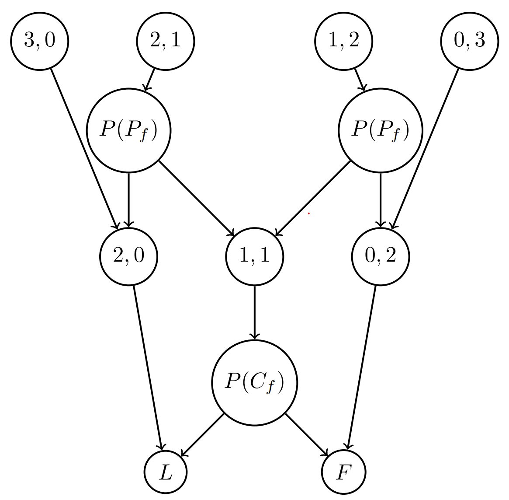

_Shoutout to Aidan and Tristan Caplan for helping me with this project._

Here is a link to the [rules](https://www.secrethitler.com/assets/Secret_Hitler_Rules.pdf) of Secret Hitler. Here is a video which quickly explains these rules:



During COVID, I got to play a ton of Secret Hitler. I was curious if I could build a bot that would help me figure out who the fascist players were based on some very basic information: Who were the president and chancellor during each turn? What policy did they pass? How many liberal and fascist cards potentially remained in the pile they drew from?

There's plenty of information about the players that a simply Bayesian network like mine can't make use of. What if someone is acting suspicious? What if Hitler intentionally passes a liberal policy in order to avoid being suspected by liberal players? What if the presidents across two turns make claims about the combination of cards they drew which are mutually incompatible? I think more advanced methods like [counterfactual regret minimization](http://modelai.gettysburg.edu/2013/cfr/cfr.pdf) should be able to integrate these kinds of considerations.

## Introduction

At the start of the game, each player is equally likely to be a fascist. At the end of every turn, based on whether the policy played was liberal or fascist, we want to update the probabilities that the president and the chancellor during that turn were fascist.

The difficulty is that the probability the president is fascist is in part determined by the probability that the chancellor is fascist and vice versa. For example, if a fascist policy is played, but we have a high prior on the chancellor being fascist, then this should be somewhat exculpatory for the president.

Therefore, a straightforward application of Bayes rule will not work. We will need to create a Bayesian network which updates priors on a player being fascist based on the other player involved in the turn. Let us define the variables.

## Variables

$$P(P_f)$$: probability that the president is fascist

$$P(C_f)$$: probability that the chancellor is fascist

$$P(L)$$: probability that a liberal policy is played

$$P(F)$$: probability that a fascist policy is played

$$P(x, y)$$ where $$x + y = 3$$: probability that the president draws $$x$$ liberal cards from the pile and $$y$$ fascist cards

$$P(x, y)$$ where $$x + y = 2$$: probability that the chancellor receives $$x$$ liberal cards and $$y$$ fascist cards from the president.

Since we observe either $$L$$ or $$F$$ at the end of every turn, our program must use this information to update the probabilities that the chancellor and president are fascist.

Specifically, **our program must be able to figure out $$P(P_f | L)$$, $$P(P_f | F)$$, $$P(C_f | L)$$, and $$P(C_f | F)$$**.

## The Network



As you can see, the president has some probability of drawing 1 out of 4 different combinations of 3 cards from the deck: 3 liberals 0 fascists, 2 liberals 1 fascists, and so on. Which 2 cards he hands down to the chancellor depend on which 3 he drew and whether he is a fascist. That is unless he draws 3 of the same kind, in which case it doesn't matter if he is a fascist or not.

The chancellor receives 2 cards, which could be both liberal, both fascist, or 1 of each. He only gets to make a decision when he receives 1 of each, and again that decision will depend on whether he is a fascist.

### Draw probabilities

Before we proceed with the rest of the network, let's first figure out how to calculate the top layer - the probabilities that the president will draw a certain combination of liberal and fascist cards.

Let $$l$$ be the remaining liberals in the pile and $$f$$ the remaining fascists. Then the probability of drawing $$x$$ liberals and $$y$$ fascists from the pile is the number of draws in which you can get $$x$$ liberals and $$y$$ fascists divided by the total number of possible draws of 3 cards:

$$
P(x, y)_{\text{ s.t. } x + y = 3} = \frac{{l \choose x} \cdot {f \choose y}}{{l + f \choose 3}}
$$

## Applying Bayes Rule

Bayes rule tells us that:

$$
P(A | B)  = \frac{P(B | A) \cdot P (A)}{P(B)}
$$

Suppose we just witnessed a fascist policy get played. How would we update the probabilities that the president and chancellor are fascist? Let's start with the president and use Bayes rule:

### President

$$
P(P_f | F) = \frac{P(F | P_f) \cdot P (P_f)}{P(F)}
$$

Let's attempt to resolve some of these terms:

$$P(P_f)$$ is simply our stored value for the prior that the president is fascist. This value starts off equal for all players and changes as more turns get recorded.

$$P(F)$$ is the probability that a fascist card would get played this turn, and this is basically the proportion of remaining cards in the pile that are fascists.

So the only thing that remains to be figured out is $$P(F | P_f)$$. What is the probability a fascist is played if the president is fascist? Well, this depends on what the president draws from the pile. If he draws 0 liberals and 3 fascists, then the final card played is guaranteed to be a fascist. Likewise, if a fascist president draws 1 liberal and 2 fascists, he will discard the 1 liberal and the final outcome will remain fascist.

The only other case where a fascist is played is when the president draws 1 fascist and 2 liberals, discards the liberal, and hands the heterogenous pair to a chancellor who is also fascist, who then discards the remaining liberal to play a fascist. In other words, for a fascist to be played when 1 fascist and 2 liberals are drawn, the chancellor also has to be fascist.

Putting these three scenarios together, we get:

$$
P(F | P_f) = P(0, 3) + P(1,2) + P(C_f | P_f) \cdot P(2,1)
$$

What is $$P(C_f | P_f)$$, and why is not equal simply to our stored prior on the chancellor being a fascist, $$P(C_f)$$? Let $$n$$ be the total number of players. We know that only a certain number of the players are fascist (specifically, $$\lceil \frac{n}{2} \rceil - 1$$ including Hitler). So, if we're assuming that the president is a fascist, the liberal odds we thought he had should be evenly distributed amongst the remaining players:

$$
P(C_f | P_f) = P(C_f) - \frac{1 - P(P_f)}{n - 1}
$$

Finally, we know how we can update the president's probability of being a fascist after seeing a fascist being played using the expanded Bayes rule:

$$
P(P_f | F) = \frac{(P(0, 3) + P(1,2) + P(C_f | P_f) \cdot P(2,1)) \cdot P (P_f)}{P(F)}
$$

### Chancellor

We will discuss how to calculate the draw probabilities in a second, but first let us consider how to apply Bayes rule to the chancellor when a fascist card is played. Let's start with the raw formula:

$$
P(C_f | F) = \frac{P(F | C_f) \cdot P (C_f)}{P(F)}
$$

Like last time, $$P (C_f)$$ is our prior that the chancellor is fascist and $$P(F)$$ is the proportion of remaining cards in the pile that are fascist.

$$P(F | C_f) $$, the probability a fascist is played given that the chancellor is fascist, is the probability that the chancellor draws 2 fascists and 0 liberals from the president plus the probability that the chancellor draws 1 fascist and 1 liberal from the president (a fascist chancellor will just discard the 1 liberal). In other words,

$$
P(F | C_f) = P(0,2) + P (1,1)
$$

Let's see if we can put this formula in terms of initial draw probabilities using the dependencies in the network picture above.

If the president draws 3 fascists, he will hand down 2 fascists to the chancellor whether he is fascist whether he is a fascist or not. And if he draws 1 liberal and 2 fascists, he will hand down 2 fascists only if he is a fascist.

$$
P(0,2) = P(0,3) + P(P_f) \cdot P(1,2)
$$

There are two scenarios in which the chancellor receives 1 fascist and 1 liberal. Either a fascist president discards a liberal when he sees 2 liberals and 1 fascists, or a liberal president discards a fascist when he sees 1 liberal and 2 fascists.

$$
P(1,1) = P(P_f) \cdot P(2,1) + (1 - P(P_f) ) \cdot P(1,2)
$$

Adding these expressions together, we get:

$$
P(F | C_f) = P(0,3) + P (1,2) + P(P_f | C_f) \cdot P(2,1)
$$

Hey, what do you know, this is identical to the formula for a fascist being played given the president is fascist (except with the term for the other player is switched). I was pretty excited when I did the arithmetic and found this neat isomorphism.

By the way, we evaluate $$P(P_f | C_f)$$ the same way as before:

$$
P(P_f | C_f) = P(P_f) - \frac{1 - P(C_f)}{n - 1}
$$

Anyways, now we can put together the extended Bayes rule for updating the probability that the chancellor is fascist when a fascist card is played:

$$
P(C_f | F) = \frac{(P(0,3) + P (1,2) + P(P_f | C_f) \cdot P(2,1)) \cdot P (C_f)}{P(F)}
$$

### When a liberal is played

When a liberal is played, we need to evaluate the following for the president:

$$
P(P_f | L) = \frac{P(L | P_f) \cdot P (P_f)}{P(L)}
$$

Again, $$P_f$$ is just the prior that the president is fascist and $$P(L)$$ is equivalent to the proportion of remaining cards that are liberal.

To figure out $$P(L | P_f)$$, we need to figure out in what scenarios a liberal would be played despite the president being a fascist. Scenario 1 is that the president draws 3 liberals and has no choice in the matter. Scenario 2 is that he draws 2 liberals and 1 fascist, discards a liberal and hands 1 liberal and 1 fascist to the chancellor, but the chancellor happens to be a liberal and plays the liberal card.

$$
P(L | P_f) = P(3,0) + (1 - P(C_f | P_f)) \cdot P(2,1)
$$

This means the expanded Bayes rule for the president when a liberal is played is:

$$
P(P_f | L) = \frac{(P(3,0) + (1 - P(C_f | P_f)) \cdot P(2,1)) \cdot P (P_f)}{P(L)}
$$

If you crunch the numbers for $$P(L | C_f)$$, you'll realize that it ends up being the same (but with terms switched) as $$P(L | P_f)$$. Meaning:

$$
P(C_f | L) = \frac{(P(3,0) + (1 - P(P_f | C_f)) \cdot P(2,1)) \cdot P (C_f)}{P(L)}
$$

## Code

Set the `players` variable to however many are playing.

After every turn, just add a line running `record turn` with `LIBERAL` or `FASCIST` and the indexes of the president and chancellor.

```python
import math

players = 9
liberals = players // 2 + 1
fascists = players - liberals
fas_probs = [fascists / players] * players
remaining = [6, 11]
LIBERAL = 0
FASCIST = 1


def nCr(n, r):
    f = math.factorial
    return f(n) / f(r) / f(n-r)


# P(x, y)
def draw_prob(lib, fas):
    assert(lib + fas == 3)
    total_remaining = remaining[LIBERAL] + remaining[FASCIST]
    possible_draws = nCr(total_remaining, 3)
    numerator = nCr(remaining[LIBERAL], lib) * nCr(remaining[FASCIST], fas)
    return numerator / possible_draws


# P(F, L | P_f, C_f)
def card_if_fas_prob(card, player, other_player):
    other_player_fas_prob = fas_prob_updated(other_player, player)
    if card is FASCIST:
        return draw_prob(0, 3) + draw_prob(1, 2) +
        draw_prob(2, 1) * other_player_fas_prob
    else:
        return draw_prob(3, 0) + draw_prob(2, 1) *
        (1 - other_player_fas_prob)


# P(C_f | P_f) or vice versa
def fas_prob_updated(player, fascist_player):
    leftover_liberal = fas_probs[fascist_player] / (players - 1)
    return fas_probs[player] - leftover_liberal


# want sum of all fascist probs == # fascists
def normalize():
    sum = 0
    for i in range(players):
        sum += fas_probs[i]
    scale = fascists / sum
    for i in range(players):
        fas_probs[i] *= scale


def get_fascists():
    sorted_fas_probs = sorted(range(players),
                              key=lambda player: fas_probs[player],
                              reverse=True)
    return sorted_fas_probs[0:fascists]


def record_turn(card, pres, chan):
    assert(card is LIBERAL or card is FASCIST)
    remaining[card] -= 1

    card_prior = remaining[card] / (remaining[LIBERAL] + remaining[FASCIST])

    # bayes rule
    fas_prob_pres = (card_if_fas_prob(card, pres, chan)
                     * fas_probs[pres]) / card_prior
    fas_probs_chan = (card_if_fas_prob(card, chan, pres)
                      * fas_probs[chan]) / card_prior

    fas_probs[pres] = fas_prob_pres
    fas_probs[chan] = fas_probs_chan

    normalize()
    print(get_fascists())
```
